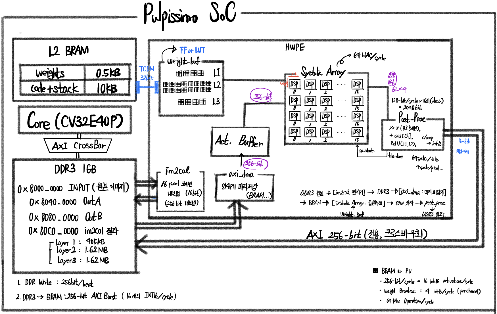

# SRCNN HWPE Accelerator on PULPissimo

A custom hardware-processing-engine (HWPE) accelerator for 3-layer SRCNN
super-resolution inference, integrated into a [PULPissimo](https://github.com/pulp-platform/pulpissimo)
RISC-V SoC and deployed on real FPGA silicon (Digilent Genesys2, Xilinx Kintex-7).

This repo contains only the code we wrote or modified — RTL, the SW driver, and
project documentation. The vendored PULP framework itself (CV32E40P core, TCDM
interconnect, hwpe-stream/hwpe-ctrl IP) is **not** included; it's the standard
open-source PULPissimo stack, fetched via [Bender](https://github.com/pulp-platform/bender)
from [pulp-platform/pulp_soc](https://github.com/pulp-platform/pulp_soc) (v5.0.1)
inside a normal `pulpissimo` checkout. See [Reproducing](#reproducing) below.

## Results

| | |
|---|---|
| **Speedup vs. CPU-only im2col baseline** | 79× (8.76 s → 110.8 ms per frame) |
| **PE utilization, out_ch=1 layer** | 25% → 99.87% (Mode B systolic remap) |
| **Accuracy, 5 channel configs vs. PyTorch golden** | 112,500 / 112,500 pixel comparisons, 4/5 configs bit-exact |
| **Accuracy, UHD 3840×2160 exhaustive** | 8,294,400 / 8,294,400 bit-exact |
| **FPGA resources (Kintex-7 xc7k325t)** | LUT 31.0% · FF 9.4% · BRAM36 44.0% · DSP48E1 9.2% |

## What this is

- **SoC**: PULPissimo — CV32E40P RISC-V core (RV32IMC)
- **Board**: Digilent Genesys2, Xilinx Kintex-7 xc7k325t, DDR3 via MIG
- **Network**: SRCNN, 3 conv layers (1→N→N→1 channels, 3×3 kernels, Q8.8 fixed-point), 5+ channel configurations validated on the same fixed 64-PE datapath
- **Core idea**: the CPU never touches pixel data. It configures a fixed hardware
  datapath over memory-mapped CSRs and lets a 64-PE systolic array do the work —
  the same division of labor ("small RISC-V core + purpose-built accelerator
  tile") used in real commercial RISC-V product lines.

## Repo layout

```
rtl/
  fc_hwpe.sv                 top FSM + CSR decode — PULPissimo ships this file
                              as an empty HWPE stub; this is our implementation (+966 lines)
  hwpe_im2col.sv              hardware im2col: 4-replica line buffer, AXI burst read/write
  hwpe_axi_dma.sv              DDR3 → 4-bank BRAM double-buffer (AXI burst read)
  hwpe_weight_buf.sv           TCDM → FF weight/bias load (9216-bit)
  hwpe_systolic_array.sv       64 PE (4×16), Output-Stationary, Mode A/B remapping
  hwpe_post_proc.sv            >>8 (Q8.8) + bias → ReLU → clamp → AXI burst write
  legacy/                      dead code kept for transparency (see below)
  integration/                 unified diffs against upstream pulp_soc v5.0.1 —
                                the SoC-level wiring changes (new AXI port, crossbar
                                routing, L2 capacity) that let this accelerator exist
sw/
  test.c                      CPU driver: 7-config sweep, CSR writes, verification
  srcnn_data_all.h             compiled-in weights/bias/golden for all configs
docs/                         working notes written during development (dated,
                              kept as-is — see project_summary.md for the clean summary)
data/scripts/                 Python: hex→C header generation, UHD test data, comparison
backup_bitstream/             three validated .bit snapshots from key milestones
```

## Architecture



The CPU's own path (CSR configuration, weight/bias staging) and the
accelerator's bulk-data path are physically separate: CSR writes go through
PULPissimo's standard TCDM+APB HWPE slot and the shared SoC crossbar; image
data (input, im2col matrix, output) rides a dedicated 256-bit AXI port added
directly at the `fc_subsystem` / `pulp_soc` boundary, bypassing the crossbar
entirely so the two kinds of traffic never contend. Full reasoning and the
exact upstream diffs are in `rtl/integration/`.

## Optimization journey

Per-FSM-state cycle counters (added directly in `fc_hwpe.sv`) turned "it's
slow" into a measurable claim: im2col was 89% of runtime while actual MAC
compute was ~2%. Every optimization round after that targeted only im2col —
the rest of the pipeline stayed flat at ~32ms regardless:

| Stage | HWPE total | im2col | Speedup (cumulative) |
|---|---|---|---|
| CPU-only im2col (baseline) | 8,760 ms | — | 1× |
| HW im2col, naive single-beat AXI | 287.5 ms | 255.7 ms | 30.5× |
| + Line buffer (removes 9× redundant TCDM reads) | 232.0 ms | 200.0 ms | 37.8× |
| + 4-way parallel BRAM read | 163.5 ms | 131.7 ms | 53.6× |
| + AXI burst (16-beat), final | 110.8 ms | 79.0 ms | **79.1×** |

## Engineering notes worth reading

- **A real alignment bug, not a logic bug**: the DDR3-direct rewrite silently
  shifted output rows by 6 pixels. Root cause: the im2col AXI read address
  wasn't 32-byte aligned for `img_w=150`; the DDR3 controller rounded down.
  The error was masked by ReLU zeroing early channels and only surfaced once
  the last layer accumulated it. Fix (`hwpe_im2col.sv`): align the AXI address
  down, and track the discarded pixel offset in a per-row `row_skip_q` table so
  the compute phase reads from the right slot.
- **Dead code, left honest**: `fc_hwpe.sv` still instantiates a 3-port TCDM
  address generator (`hwpe_addr_gen`, superseded by `hwpe_im2col`'s AXI path —
  its own comment notes it was starving CPU TCDM arbitration when live) and a
  `hwpe_mac_array` (replaced by the systolic array), both permanently disabled
  via tied-off enable signals rather than removed. Of the accelerator's 4 TCDM
  master ports, only 1 (`hwpe_weight_buf`) ever issues a real request — this
  is visible directly in `rtl/legacy/` and in the tie-offs inside `fc_hwpe.sv`.
- **Mode B — reusing hardware instead of growing it**: SRCNN's last layer has
  1 output channel, so the naive 4-row×16-col systolic mapping leaves 3 of 4
  rows idle (25% utilization). Mode B reinterprets the same 64 physical PEs as
  1×64 (broadcast one weight to all 64 PEs, 64 pixels in parallel) — no extra
  hardware, PE utilization goes to 99.87%.

## Verification

Exhaustive, not sampled: 5 channel configs compared pixel-for-pixel against a
PyTorch reference (112,500 pairs, 4/5 configs bit-exact, the Q8.8 config within
max-diff 3), plus a full 3840×2160 frame pulled off real DDR3 via JTAG and
diffed against the same reference — 8,294,400 / 8,294,400 bit-exact.

## Reproducing

This accelerator is built against `pulp_soc` v5.0.1 inside a standard
PULPissimo checkout:

```bash
git clone https://github.com/pulp-platform/pulpissimo.git
cd pulpissimo && bender update   # fetches pulp_soc v5.0.1, hwpe-stream, hwpe-ctrl, etc.
```

Then apply the patches in `rtl/integration/` against the checked-out
`pulp_soc` sources (`.bender/git/checkouts/pulp_soc-*/`), and drop the files
from `rtl/` into `rtl/fc/` in that same checkout. `sw/test.c` builds against
PULP's `pulp-runtime` the normal way (`make clean all platform=fpga io=uart`).

## License & attribution

This project builds directly on [PULP Platform](https://pulp-platform.org/)
(© ETH Zürich and University of Bologna), specifically
[pulp-platform/pulp_soc](https://github.com/pulp-platform/pulp_soc) v5.0.1
inside the [pulpissimo](https://github.com/pulp-platform/pulpissimo) SoC.
PULP's own RTL is licensed under the
[Solderpad Hardware License, Version 0.51](https://solderpad.org/licenses/SHL-0.51/).

- `rtl/fc_hwpe.sv` is a **derivative work**: PULPissimo ships this file as an
  empty HWPE stub carrying ETH Zürich / University of Bologna's original
  Solderpad HSL v0.51 header, which is kept intact at the top of the file as
  the license requires. Everything inside the FSM body (+966 lines) is
  original work written for this project.
- `rtl/hwpe_im2col.sv`, `hwpe_axi_dma.sv`, `hwpe_weight_buf.sv`,
  `hwpe_systolic_array.sv`, `hwpe_post_proc.sv`, `rtl/legacy/*`, and
  everything in `sw/` are wholly new files with no PULP-derived content.
- `rtl/integration/*.diff` are unified diffs against PULP's own
  `pulp_soc.sv` / `fc_subsystem.sv` / `soc_interconnect_wrap.sv` /
  `l2_ram_multi_bank.sv` / `pkg_soc_interconnect.sv` (also Solderpad HSL
  v0.51) — kept as diffs rather than full files so what's PULP's and what's
  ours stays unambiguous.

No PULP source beyond these attributed diffs and the one derivative file
above is redistributed in this repo; the framework itself is fetched
separately via Bender (see [Reproducing](#reproducing)).

## Development notes

RTL and SW in this repo were implemented with Claude Code, under close
direction: architecture decisions (DDR3-direct redesign, Mode B remapping,
AXI/TCDM path separation), debugging (the alignment bug above), verification
methodology, and FPGA bring-up were driven and checked step by step rather
than accepted as a black box. This repo was also used as a deliberate code
walkthrough after the fact — reading every file, diffing against upstream
PULP, and confirming line-by-line what each piece actually does — specifically
so the implementation could be explained and defended in depth, not just cited.
